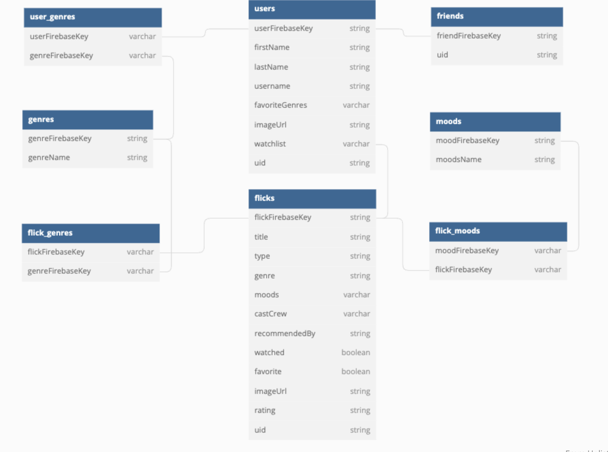

# POPPED
## Topics
- [Primary Features](#primary-features)
- [Target Audience](#target-audience)
- [Purpose](#purpose)
- [Getting Started](#getting-started)
- [Contributions](#contributions)
- [ERDs](#ERDs)
- [Loom Presentation](#loom-presentation)
___
## Primary Features
The primary features of this product allow the user to:
Create flick cards to add to their watchlist
Edit the flicks on their watchlist
Remove cards from their watchlist
Add flicks as favorite
Mark flicks as watched
Search flicks by name, genre, recommended by, cast/crew, and mood
Shuffle flicks based on entered criteria to get recommendations based on type, genre, mood, recommended by, and/or watched/unwatched
Create and edit your user profile

## Target Audience
The target audience for this app is anyone who finds themself scrolling through multiple streaming apps, wasting precious time trying to decide what they want to watch.

## Purpose
This app is designed to answer the question “What do I want to watch?” It is intended to eliminate the need for scrolling through multiple streaming services in order to get ideas, as well as keep track of recommendations and watchlists. 

## Getting Started
In order to test the app, pull it down to your local machine and npm run dev to start the application on your browser. You can then sign in with google authorization and begin adding flicks. They are tracked by users' userID, which means you can only see the flicks that you have personally created. 

## Contributions
This app was created by Kristen Chandler
https://github.com/kmchandler

## ERD

        
## Loom Video Walkthrough
